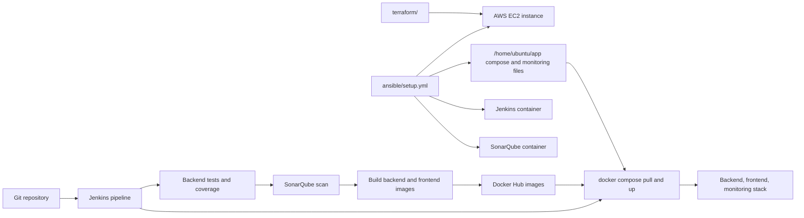

# Deployment

This document describes how AI Money Mentor is built, deployed, and operated from the files in this repository.

The deployment model is EC2-based:

- Terraform creates the AWS instance and security group.
- Ansible prepares the instance, installs Docker, starts Jenkins and SonarQube, and copies runtime Compose/monitoring files.
- Jenkins tests the backend, runs SonarQube analysis, builds Docker images, pushes them to Docker Hub, and redeploys with Docker Compose.
- Docker Compose runs the application, Prometheus, Grafana, node-exporter, and cAdvisor.

## Table of Contents

- [Deployment Flow](#1-deployment-flow)
- [CI/CD Pipeline](#2-cicd-pipeline)
  - [Pipeline Environment](#pipeline-environment)
  - [Stages](#stages)
  - [Test and Coverage Scope](#test-and-coverage-scope)
  - [Deployment Behavior](#deployment-behavior)
- [Infrastructure Provisioning](#3-infrastructure-provisioning)
  - [Provider and Region](#provider-and-region)
  - [EC2 Instance](#ec2-instance)
  - [Security Group](#security-group)
  - [Terraform Inputs and Outputs](#terraform-inputs-and-outputs)
- [Server Configuration](#4-server-configuration)
  - [Host Setup](#host-setup)
  - [Runtime Files](#runtime-files)
  - [Jenkins Container](#jenkins-container)
  - [SonarQube Container](#sonarqube-container)
- [Containerization and Runtime](#5-containerization-and-runtime)
  - [Backend Image](#backend-image)
  - [Frontend Image](#frontend-image)
  - [Local Compose](#local-compose)
  - [Production Compose](#production-compose)
- [Monitoring](#6-monitoring)
  - [Prometheus](#prometheus)
  - [Grafana](#grafana)
  - [Host and Container Exporters](#host-and-container-exporters)
- [Code Quality Analysis](#7-code-quality-analysis)
  - [Sonar Project Settings](#sonar-project-settings)
  - [Jenkins Scanner Behavior](#jenkins-scanner-behavior)
- [Operations](#8-operations)
  - [Main Service URLs](#main-service-urls)
  - [Runtime State](#runtime-state)
  - [Health Checks](#health-checks)
  - [Deployment Update Command](#deployment-update-command)
  - [Environment and Secrets](#environment-and-secrets)

## 1. Deployment Flow



End-to-end, the repo expects this sequence:

1. Provision the EC2 host with Terraform.
2. Configure the host with Ansible.
3. Configure Jenkins credentials and SonarQube integration.
4. Run the Jenkins pipeline.
5. Jenkins publishes images and updates the Compose deployment on the EC2 host.
6. Jenkins checks the backend health endpoint after deployment.

## 2. CI/CD Pipeline

The pipeline is defined in [`Jenkinsfile`](../Jenkinsfile).

### Pipeline Environment

The Jenkinsfile sets these image and project names:

| Name | Value |
| --- | --- |
| Docker Hub user | `mahadevballa` |
| Backend image | `mahadevballa/mm-backend` |
| Frontend image | `mahadevballa/mm-frontend` |
| Sonar project key | `money-mentor` |

The pipeline references these Jenkins-managed values:

| Jenkins value | Used for |
| --- | --- |
| `dockerhub-creds` | Docker Hub username/password for image push |
| `ec2-host` | Hostname or IP used by the deployment health check |
| `SonarQube` | Jenkins SonarQube server configuration name |

### Stages

| Stage | Behavior |
| --- | --- |
| `Checkout` | Checks out the repository with `checkout scm`. |
| `Backend: Install & Test` | Installs `uv` if missing, runs `uv sync --locked --group dev`, then runs selected backend pytest files with coverage. |
| `Lint` | Runs `uv run ruff check . --output-format=full` inside `backend/`. This stage is non-blocking because the command ends with `|| true`. |
| `SonarQube Analysis` | Runs `sonar-scanner` against `backend/`, with tests in `backend/tests` and coverage from `backend/coverage.xml`. |
| `Quality Gate` | Calls `waitForQualityGate abortPipeline: false`, so the pipeline records the gate result but does not fail only because the gate fails. |
| `Docker Build & Push` | Builds backend and frontend images with `--no-cache`, tags both as `latest` and `${BUILD_NUMBER}`, and pushes all tags to Docker Hub. |
| `Deploy to EC2` | Runs `docker compose -f /home/ubuntu/app/docker-compose.yml pull`, then `up -d --remove-orphans`, then prunes unused images. |
| `Health Check` | Waits 20 seconds and checks `http://${EC2_HOST}:8000/health`. It also prints frontend and Grafana URLs. |

### Test and Coverage Scope

The Jenkinsfile runs these backend tests:

- `tests/test_finance.py`
- `tests/test_fire_stepup.py`
- `tests/test_life_event.py`
- `tests/test_mf_xray.py`
- `tests/test_couple.py`

Coverage is written to `backend/coverage.xml` and archived for SonarQube.

### Deployment Behavior

The deployment stage does not rebuild on the server. It pulls the image tags already pushed to Docker Hub and recreates containers through the Compose file at:

```text
/home/ubuntu/app/docker-compose.yml
```

That path is populated by Ansible, which copies [`docker-compose.prod.yml`](../docker-compose.prod.yml) there as `docker-compose.yml`.

## 3. Infrastructure Provisioning

Terraform lives in [`terraform/`](../terraform).

### Provider and Region

[`terraform/main.tf`](../terraform/main.tf) uses the AWS provider `~> 5.0`.

The default region is:

```text
ap-south-1
```

### EC2 Instance

Terraform creates one EC2 instance:

| Setting | Value |
| --- | --- |
| Resource | `aws_instance.money_mentor` |
| AMI variable | `var.ami_id` |
| Default AMI description | Ubuntu 24.04 LTS AMI for `ap-south-1` |
| Default AMI ID | `ami-0f58b397bc5c1f2e8` |
| Instance type | `m7i-flex.large` |
| Root volume | `25` GB `gp3` |
| Shutdown behavior | `stop` |
| Detailed monitoring | `false` |
| Metadata tokens | `required` |

Terraform requires an existing AWS key pair name through `var.key_name`.

### Security Group

Terraform creates `money-mentor-sg`.

Inbound rules:

| Port | Purpose | CIDR |
| --- | --- | --- |
| `22` | SSH | `var.allowed_ssh_cidr` |
| `8000` | Backend API and metrics | `0.0.0.0/0` |
| `3000` | Frontend | `0.0.0.0/0` |
| `8080` | Jenkins | `0.0.0.0/0` |
| `9000` | SonarQube | `0.0.0.0/0` |
| `9090` | Prometheus | `0.0.0.0/0` |
| `3001` | Grafana | `0.0.0.0/0` |

Outbound traffic is open to `0.0.0.0/0`.

The repo does not include a reverse proxy or TLS configuration. Services are exposed directly on their configured ports.

### Terraform Inputs and Outputs

Required variables:

- `key_name`
- `allowed_ssh_cidr`

Defaulted variables:

- `aws_region`
- `ami_id`

Useful outputs:

- `ec2_public_ip`
- `ec2_public_dns`
- `backend_url`
- `frontend_url`
- `jenkins_url`
- `sonarqube_url`
- `grafana_url`
- `ec2_instance_id`

## 4. Server Configuration

Ansible lives in [`ansible/`](../ansible).

[`ansible/inventory.ini`](../ansible/inventory.ini) currently targets:

```text
65.1.73.219 ansible_user=ubuntu ansible_ssh_private_key_file=~/.ssh/money-mentor-key.pem
```

Strict host key checking is disabled in the inventory.

### Host Setup

[`ansible/setup.yml`](../ansible/setup.yml) configures the EC2 host as `ubuntu` with privilege escalation.

It performs these setup tasks:

- Installs the `community.docker` Ansible collection on the control node.
- Updates apt cache.
- Installs base packages: `ca-certificates`, `curl`, `gnupg`, `git`, `htop`, `unzip`, and `python3-pip`.
- Adds the Docker apt repository and GPG key.
- Installs Docker Engine, Docker CLI, containerd, Buildx, and the Docker Compose plugin.
- Adds the `ubuntu` user to the `docker` group.
- Starts and enables the Docker service.
- Creates a 2 GB swap file at `/swapfile` if one does not already exist.
- Sets `vm.swappiness=10`.
- Sets `vm.max_map_count=262144` for SonarQube.
- Configures Docker JSON-file log rotation with `max-size=10m` and `max-file=3`.

### Runtime Files

The playbook uses this app directory:

```text
/home/ubuntu/app
```

It creates:

- `/home/ubuntu/app`
- `/home/ubuntu/app/monitoring`
- `/home/ubuntu/app/monitoring/grafana`

It copies:

| Source | Destination |
| --- | --- |
| `docker-compose.prod.yml` | `/home/ubuntu/app/docker-compose.yml` |
| `monitoring/prometheus.yml` | `/home/ubuntu/app/monitoring/prometheus.yml` |
| `monitoring/grafana/datasources.yml` | `/home/ubuntu/app/monitoring/grafana/datasources.yml` |

### Jenkins Container

Ansible starts Jenkins as a Docker container:

| Setting | Value |
| --- | --- |
| Image | `jenkins/jenkins:lts-jdk17` |
| Container name | `jenkins` |
| Ports | `8080:8080`, `50000:50000` |
| Restart policy | `unless-stopped` |
| Volume | `jenkins_home:/var/jenkins_home` |
| Docker socket | `/var/run/docker.sock:/var/run/docker.sock` |
| Java option | `-Dhudson.plugins.git.GitSCM.ALLOW_LOCAL_CHECKOUT=true` |

The playbook also attempts to install the Docker CLI inside the Jenkins container.

### SonarQube Container

Ansible starts SonarQube separately from the application Compose stack:

| Setting | Value |
| --- | --- |
| Image | `sonarqube:community` |
| Container name | `sonarqube` |
| Port | `9000:9000` |
| Restart policy | `unless-stopped` |
| Environment | `SONAR_ES_BOOTSTRAP_CHECKS_DISABLE=true` |

No SonarQube named volume is defined in the playbook.

## 5. Containerization and Runtime

The repo has two Compose files:

| File | Use |
| --- | --- |
| [`docker-compose.yml`](../docker-compose.yml) | Local build/run from source |
| [`docker-compose.prod.yml`](../docker-compose.prod.yml) | Server runtime using Docker Hub images |

### Backend Image

The backend image is defined by [`backend/Dockerfile`](../backend/Dockerfile).

Build/runtime behavior:

- Uses `python:3.13-slim`.
- Copies `uv` from `ghcr.io/astral-sh/uv:0.11.7`.
- Installs locked production dependencies with `uv sync --locked --no-dev --no-install-project`.
- Copies the project into `/app`.
- Creates a non-root `appuser`.
- Creates `/app/data` for SQLite data.
- Exposes port `8000`.
- Runs Uvicorn with one worker:

```text
uvicorn main:app --host 0.0.0.0 --port 8000 --workers 1
```

The Dockerfile comment notes that one worker keeps SQLite writes safe.

At startup, [`backend/main.py`](../backend/main.py) initializes the database, warms the AMFI NAV cache, builds the RAG knowledge index, mounts routers, exposes `/health`, and exposes Prometheus metrics at `/metrics`.

### Frontend Image

The frontend image is defined by [`frontend/Dockerfile`](../frontend/Dockerfile).

Build/runtime behavior:

- Uses `node:22-alpine`.
- Installs dependencies with `npm ci`.
- Runs `npm run build`.
- Uses Next.js standalone output from [`frontend/next.config.ts`](../frontend/next.config.ts).
- Runs as a non-root `nextjs` user.
- Exposes port `3000`.
- Starts with:

```text
node server.js
```

`NEXT_PUBLIC_API_URL` is a Docker build argument and is baked into the frontend bundle at build time. The Dockerfile default is:

```text
http://localhost:8000
```

The Jenkinsfile does not pass a different build argument when building the frontend image.

### Local Compose

[`docker-compose.yml`](../docker-compose.yml) builds both services from local source.

Backend:

- Build context: `./backend`
- Container: `mm-backend`
- Port: `8000:8000`
- Env file: `./backend/.env`
- Runtime database URL: `sqlite+aiosqlite:////app/data/money_mentor.db`
- Runtime CORS origins: `http://localhost:3000,http://frontend:3000`
- Volume: `backend_data:/app/data`
- Healthcheck: calls `http://localhost:8000/health`

Frontend:

- Build context: `./frontend`
- Container: `mm-frontend`
- Port: `3000:3000`
- Build arg: `NEXT_PUBLIC_API_URL=http://localhost:8000`
- Environment: `NODE_ENV=production`
- Starts only after the backend is healthy

### Production Compose

[`docker-compose.prod.yml`](../docker-compose.prod.yml) uses pushed images instead of local builds.

Application services:

| Service | Image | Port | Container |
| --- | --- | --- | --- |
| `backend` | `mahadevballa/mm-backend:latest` | `8000:8000` | `mm-backend` |
| `frontend` | `mahadevballa/mm-frontend:latest` | `3000:3000` | `mm-frontend` |

Backend production runtime:

- Reads environment from `.env` beside the Compose file.
- Overrides `DATABASE_URL` to `sqlite+aiosqlite:////app/data/money_mentor.db`.
- Sets `ALLOWED_ORIGINS` to `http://localhost:3000,http://${EC2_PUBLIC_IP}:3000`.
- Persists SQLite data in `backend_data:/app/data`.
- Healthcheck calls `http://localhost:8000/health`.

The production Compose file references `.env` and `EC2_PUBLIC_IP`. The Ansible playbook copies the Compose and monitoring files, but it does not create the production `.env` file.

## 6. Monitoring

Monitoring config lives in [`monitoring/`](../monitoring).

### Prometheus

Prometheus runs from `prom/prometheus:v2.51.0` in production Compose.

Runtime settings:

- Container: `mm-prometheus`
- Port: `9090:9090`
- Config file: `/etc/prometheus/prometheus.yml`
- Data volume: `prometheus_data:/prometheus`
- Retention: `7d`
- Web lifecycle enabled with `--web.enable-lifecycle`

[`monitoring/prometheus.yml`](../monitoring/prometheus.yml) defines four scrape jobs:

| Job | Target | Notes |
| --- | --- | --- |
| `money-mentor-backend` | `mm-backend:8000` | Scrapes `/metrics`, exposed by `prometheus-fastapi-instrumentator`. |
| `node-exporter` | `mm-node-exporter:9100` | Host metrics from node-exporter. |
| `cadvisor` | `mm-cadvisor:8080` | Container metrics from cAdvisor. |
| `prometheus` | `localhost:9090` | Prometheus self-scrape. |

Global scrape and evaluation intervals are both `15s`.

### Grafana

Grafana runs from `grafana/grafana:10.4.0` in production Compose.

Runtime settings:

- Container: `mm-grafana`
- Port: `3001:3000`
- Admin user: `admin`
- Admin password: `admin`
- Sign-up disabled
- Data volume: `grafana_data:/var/lib/grafana`

[`monitoring/grafana/datasources.yml`](../monitoring/grafana/datasources.yml) provisions Prometheus as the default Grafana datasource:

```text
http://prometheus:9090
```

No dashboard provisioning files are present in the repo.

### Host and Container Exporters

Production Compose also runs:

| Service | Image | Purpose |
| --- | --- | --- |
| `node-exporter` | `prom/node-exporter:v1.8.0` | Host-level metrics using host `/proc`, `/sys`, and root filesystem mounts. |
| `cadvisor` | `gcr.io/cadvisor/cadvisor:v0.49.1` | Container metrics using Docker and host filesystem mounts. |

These services are not published to public host ports in the Compose file. Prometheus scrapes them over the Compose network.

## 7. Code Quality Analysis

SonarQube is configured in two places:

- [`sonar-project.properties`](../sonar-project.properties)
- Inline scanner flags in [`Jenkinsfile`](../Jenkinsfile)

Both configurations focus analysis on the backend.

### Sonar Project Settings

The repository config defines:

| Setting | Value |
| --- | --- |
| Project key | `money-mentor` |
| Project name | `AI Money Mentor` |
| Version | `1.0` |
| Sources | `backend` |
| Tests | `backend/tests` |
| Python version | `3.13` |
| Coverage report | `backend/coverage.xml` |
| Encoding | `UTF-8` |

Exclusions include:

- `node_modules`
- `__pycache__`
- `.venv`
- `.next`
- `migrations`
- `backend/tests`

### Jenkins Scanner Behavior

The Jenkinsfile runs `sonar-scanner` with explicit properties instead of relying only on `sonar-project.properties`.

It sets:

- `sonar.projectKey=${SONAR_PROJECT}`
- `sonar.projectName="AI Money Mentor"`
- `sonar.sources=backend`
- `sonar.tests=backend/tests`
- `sonar.test.inclusions=backend/tests/**`
- `sonar.exclusions=**/node_modules/**,**/__pycache__/**,**/.venv/**,**/.next/**,backend/tests/**`
- `sonar.python.version=3.13`
- `sonar.python.coverage.reportPaths=backend/coverage.xml`

The quality gate is checked, but `abortPipeline` is set to `false`.

## 8. Operations

### Main Service URLs

After Terraform and Ansible, the repo exposes services on these ports:

| Service | URL pattern |
| --- | --- |
| Frontend | `http://<ec2-public-ip>:3000` |
| Backend | `http://<ec2-public-ip>:8000` |
| Backend health | `http://<ec2-public-ip>:8000/health` |
| Backend metrics | `http://<ec2-public-ip>:8000/metrics` |
| Jenkins | `http://<ec2-public-ip>:8080` |
| SonarQube | `http://<ec2-public-ip>:9000` |
| Prometheus | `http://<ec2-public-ip>:9090` |
| Grafana | `http://<ec2-public-ip>:3001` |

### Runtime State

Persistent Docker volumes defined by the repo:

| Volume | Used by |
| --- | --- |
| `backend_data` | SQLite database at `/app/data/money_mentor.db` |
| `prometheus_data` | Prometheus TSDB data |
| `grafana_data` | Grafana data |
| `jenkins_home` | Jenkins home directory |

The backend database is SQLite in the current Compose setup. Both local and production Compose override `DATABASE_URL` so the container writes to `/app/data/money_mentor.db`.

### Health Checks

Health checks exist at two layers:

- Docker Compose checks the backend container with `GET /health`.
- Jenkins checks `http://${EC2_HOST}:8000/health` after deployment.

The frontend service depends on the backend Compose healthcheck before it starts.

### Deployment Update Command

The Jenkins deployment stage uses:

```bash
docker compose -f /home/ubuntu/app/docker-compose.yml pull
docker compose -f /home/ubuntu/app/docker-compose.yml up -d --remove-orphans
docker image prune -f
```

This means a new deployment is driven by the image tags in Docker Hub and the Compose file copied by Ansible.

### Environment and Secrets

The backend environment shape is documented in [`backend/.env.example`](../backend/.env.example).

The active variables include:

- `LLM_PROVIDER`
- `GROQ_API_KEY`
- `GEMINI_API_KEY`
- `HF_TOKEN`
- `SARVAM_API_KEY`
- `DATABASE_URL`
- `APP_NAME`
- `APP_VERSION`
- `DEBUG`
- `SECRET_KEY`
- `ALLOWED_ORIGINS`
- SMTP settings
- finance default assumptions

Local Compose reads `backend/.env`.

Production Compose reads `.env` from the server-side app directory where `/home/ubuntu/app/docker-compose.yml` runs.
