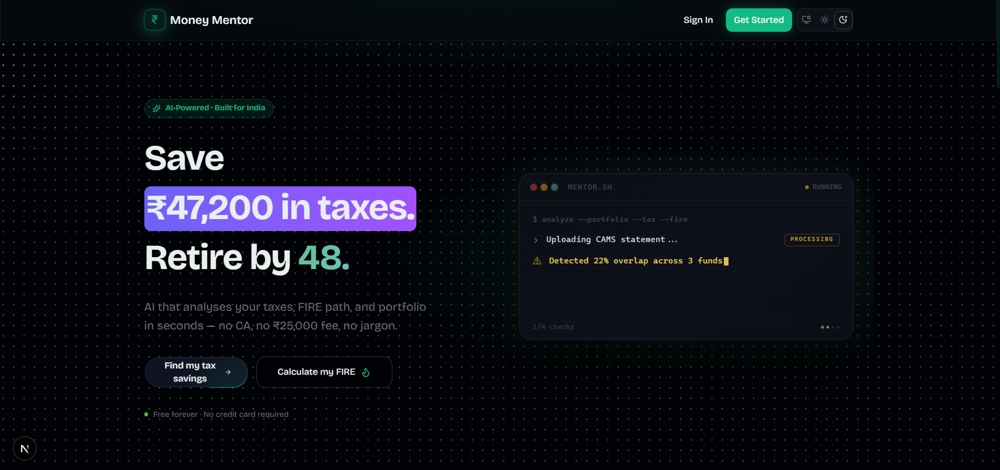
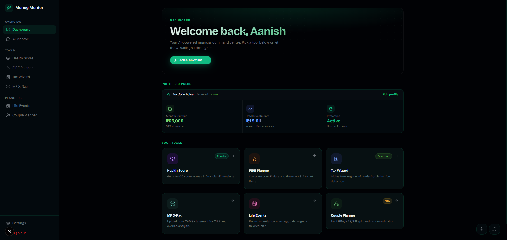

# AI Money Mentor Frontend

Next.js frontend for AI Money Mentor.

Handles auth, profile capture, planners, portfolio views, chat, and voice interactions. It calls the FastAPI backend and turns computed results into usable workflows.

## Scope

- Authentication and onboarding UI
- Profile capture and portfolio screens
- Planner flows for FIRE, health score, tax, life events, couple planning, and MF X-Ray
- Chat UI with streaming responses
- Voice input and playback flows
- Result views, summaries, and comparison cards

## Product Experience Goals

- Keep data entry fast for non-expert users
- Make portfolio runs and what-if runs clearly different
- Show outputs in a way users can inspect, not just accept
- Keep flows usable on both desktop and mobile
- Reuse the same interaction patterns across features

## How It Connects to Backend

- Calls FastAPI endpoints per feature; there is no generic "process" call
- Receives deterministic results and generated advice from the backend
- Renders planner flows, result states, and follow-up interactions on top of those responses
- Uses session-based APIs for chat and feature continuity

## UI Architecture

The frontend is split by routing, feature UI, and shared client code.

- `src/app/` holds App Router pages, layouts, and route-level composition
- `src/components/` holds feature modules and shared UI pieces
- `src/lib/` holds API clients, shared types, and small helpers

The separation is simple:

- routes decide what page is shown
- components handle feature rendering and interaction
- `lib` handles backend calls and shared client-side logic

## Key UI Patterns

- Card-based result views for summaries, actions, and comparisons
- Step-based flows where a feature needs staged input
- Loading and analysis states for backend-driven workflows
- Progressive disclosure so users do not have to process everything at once

## Chat Experience

The chat UI is session-based and built around financial follow-ups.

- Suggested prompt chips
- Streamed responses
- Voice recording support
- Speech playback support
- Message formatting tuned for financial explanations

## UI Screenshots

### Landing Page

### Dashboard

## Notes

This README focuses on frontend structure and UX.

For setup and system-level details:

- Root README: [`../README.md`](../README.md)
- Backend: [`../backend/README.md`](../backend/README.md)
- Architecture: [`../docs/ARCHITECTURE.md`](../docs/ARCHITECTURE.md)
- API Contract: [`../docs/API_CONTRACT.md`](../docs/API_CONTRACT.md)
